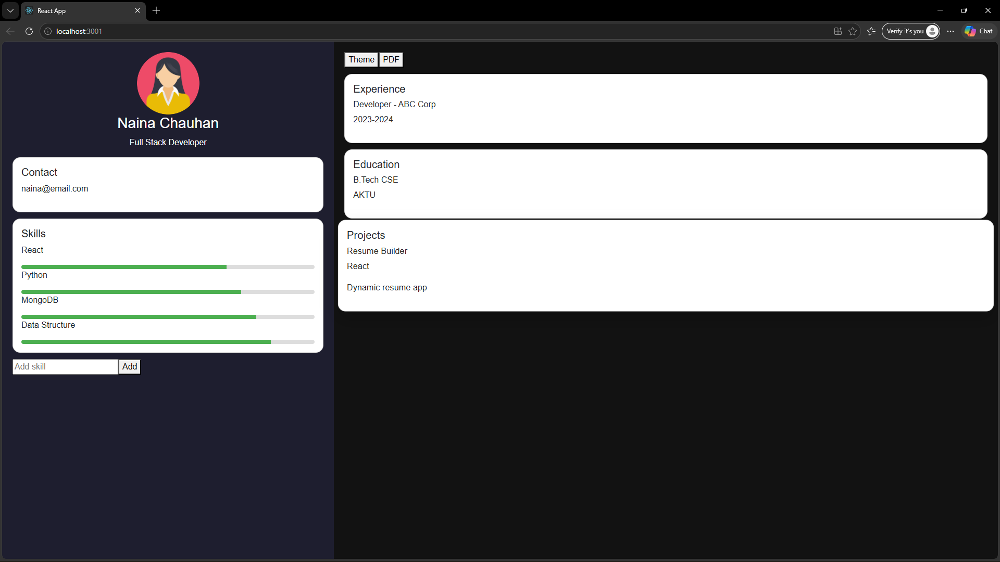

## Resume Builder App

A modern and responsive Resume Builder Application built using React.
This project allows users to create, customize, and download their resume dynamically with a clean and attractive UI.

---

## Features

-  Dynamic Resume Rendering
-  Dark Mode Toggle
-  Download Resume as PDF
-  Add Skills Dynamically
-  Local Storage Support (Auto Save)
-  Modern UI with Hover Effects
-  Fully Responsive Layout
-  Component-Based Architecture

## Tech Stack

- React JS
- Bootstrap
- JavaScript (ES6)
- HTML5
- CSS3

## Project Structure

src/
 ├── components/
 │    ├── Header.js
 │    ├── Profile.js
 │    ├── Skills.js
 │    ├── Experience.js
 │    ├── Education.js
 │    ├── Projects.js
 ├── data/
 │    └── profileData.js
 ├── App.js
 ├── index.js
 ├── index.css

---

## Screenshots

### Application UI

## Navigate to project folder

cd resume-app

## Install dependencies

npm install

## Run the application

npm start

## Future Enhancements

- Full Resume Edit Form (Name, Email, Experience)
- Backend Integration (MongoDB + Express)
- Multiple Resume Templates
- Authentication System

